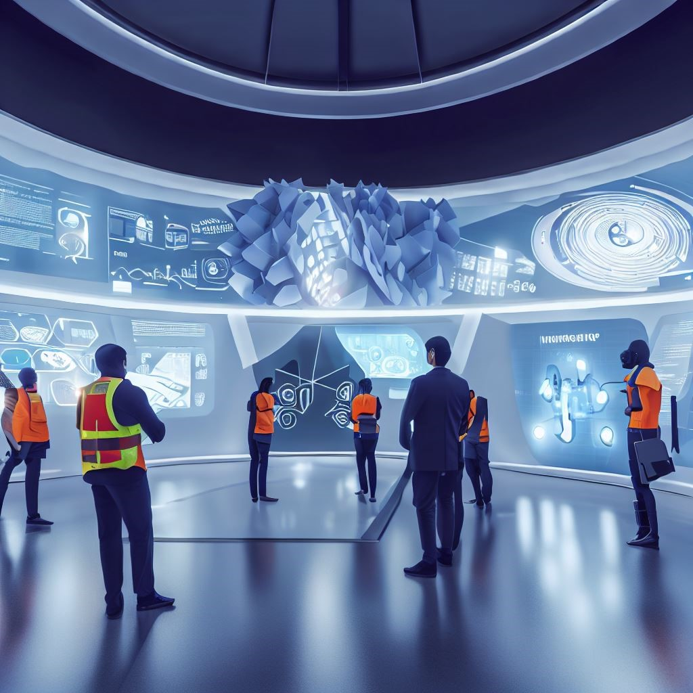

# Future Museum

This is a game tool that I designed for you to help you practice responsible innovation. The game is called Future Museum, and it is a team-based game that aims to make you review your technology project from a future perspective and think about its long-term impact on society and environment.

## Benefits

- It can help you enhance your sense of responsibility and ethical awareness, and let you consider the positive and negative impacts of your technology on future society and environment, and how to prevent or mitigate potential risks and harms.
- It can help you improve your communication and collaboration skills, and let you share and present your technology project with other teams, and accept their questions, feedbacks, and ratings.
- It can help you improve your imagination and creativity, and let you envision the possibilities and scenarios of your technology in the future.

## Preparing

- Determine the number and grouping of participants, suggest each team has 3 to 5 people, each team chooses a technology project that they are developing or planning to develop.
- Determine the time and place for the game, suggest each team has 5 to 10 minutes to design their exhibit, and play the game in a space that is suitable for presentation and interaction.
- Determine the materials and equipment needed for the game, suggest each team has paper, pen, computer, projector, and other tools to make and show their exhibit.

## During the game

The players are expected to go through the following steps in this game:

1. **Setting a Future Background**: Teams should create a scenario for what the world will look like 50 years from now. This should incorporate changes in technology, society, politics, economy, and environment.
 
2. **Designing the Exhibit**: 
   - **Name**: Choose a catchy name for your exhibit.
   - **Description**: Write a brief paragraph describing your tech project and its application in the future.
   - **Visuals**: Use images, videos, or models to show how your tech functions in the future scenario.
   - **Narrative**: Craft a short story related to your technology, showcasing how it is used in the society of the future.

3. **Presenting the Exhibit**:
   - **Positive Impacts**: Describe the societal and environmental benefits brought by your technology.
   - **Potential Risks**: Identify potential risks and challenges that might come with the adoption of your tech. You can analyze it by finding all the stakeholders and analyze the risk each stakeholder might face.
   - **Risk Management**: Discuss how you plan to reduce or manage these risks.

4. **Interactive Evaluation**:
   - Other teams can inquire or provide feedback from perspectives of:
     - **Technical Feasibility**: Is the tech genuinely achievable in the future?
     - **Social Acceptance**: Would people be willing and open to adopting this tech?
     - **Environmental Impact**: What are the long-term effects of this tech on the environment?
     - **Ethical Considerations**: Are there any ethical concerns associated with the deployment of this technology?
   - Rating criteria include:
     - **Innovation**: How novel is the tech?
     - **Feasibility**: How practical is the tech in real-world scenarios?
     - **Responsibility**: Has the team thoroughly considered potential risks and challenges?
     - **Articulation**: How clearly has the team conveyed their concepts?

5. **Reflection and Recap**: Post-presentation, each team should consolidate feedback, contemplate on how to refine their tech or strategy to better fit future challenges and opportunities.

## Discussion

- Each team summarizes the areas that need improvement or attention for their technology project based on other teams’ ratings and feedbacks, and what they learned from this game.
- All participants discuss together the inspiration and influence of this game on their technology development, and their views and suggestions on responsible innovation.

