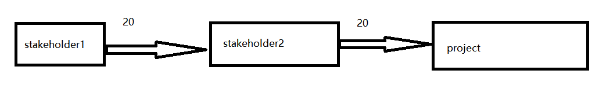

# Chemical Reaction 

## Introduction

This tool that actually a game aims to help project managers identify and analyze stakeholders related to the project, and gain a deeper understanding of their relationships\. Through this tool, you can better understand the interactions between different stakeholders and the impact of the project on them\. This helps to evaluate the sustainability, legal compliance, and ethical considerations of the project\.

## Method

### 1. Grouping\(5 min\)

Divide the participants into several groups: project participants, project clients, law enforcement agencies and governments, society, environment, and future humanity\.These factors can all have an impact on our project, so we refer to them as "stakeholders" in the project. It should be noted that a stakeholder does not necessarily have to be a human or human organization, it can be anything that can have an impact on the project, even a plastic water bottle.

All participants in the game must choose a stackholder they represent, and each member must ensure that they have sufficient knowledge of the stackholder they have chosen, to the extent that they can answer the following questions: Do they understand the connection between the stackholder they have chosen and the project they have chosen for the game? Can I decompose the larger stackholder I have chosen into more detailed ones? Has the chosen stackholder had sufficient impact on the project? What changes will happen to the chosen stackeholder in the future and what impact will the changes have on our project?

Note: If there are too many players involved, the corresponding content can be divided into smaller parts\. For example, the environment can be divided into: urban environment, natural environment, and natural environment can be divided into climate zones, oceans, animals, and plants\.\.\.\.\.\.

### 2. Establish a diagram\(20 min\)

According to the previous grouping, each person needs to break down their stakeholders into more detailed ones and list all of them. In the picture we are drawing, we need to find the connection between our stack holders and those of others in the game, and use arrows to indicate it. The starting point of the arrow is the affecting stakeholder, and the ending point is the affected stakeholder. Note: Our diagram can be very complex, so when drawing, we can roughly place the stackholder that causes greater impact in a position that makes it easier to draw arrows.

Note: The intensity we set at this stage of the game (i.e. the weights added on the arrows) is only a rough weight, and more detailed weights will be given in the next stage through some questions.

### 3. Relationship evaluation\(30 min\)

Evaluate each relationship, considering the following factors(IL, I, LC, MF):

Impact level(IL): How much impact does the project between the different stakeholders? 

Let's use numbers one to five to represent the factors that affect this, with one indicating minimal impact and five indicating significant impact. Note: Without the number zero, it means there is no impact because all we have chosen are stakeholders. If there is no impact, it should not be included in our diagram. Afterwards, consider the time when this stakeholder will have an impact. If it will have an impact in the present, multiply the score by 1.5. If it will have an impact in the future, multiply the score by 1. This is because the current impact is tangible, while the future impact has not yet occurred. We cannot guarantee whether it will occur or whether it will occur as expected. Above all, we have the score IL.

Interrelationships(I): How do the relationships between different stakeholders affect their attitudes and interactions towards the project? 

This factor is a factor that evaluates the relationship between different stakeholders, considering that in some cases, different stakeholders may be limited by various factors, resulting in some influencing factors on in-depth cooperation issues. For example, fish produced in the ocean are highly favored by local residents due to their inherent nutrients, but due to geographical limitations, people living in inland areas tend to choose locally produced freshwater fish over marine fish. We divide the degree of impact here into five levels using numbers one to five, similar to IL (Impact level). However, unlike before, our I (Relationships) has a positive and negative impact, indicating whether it has a positive or negative impact on other stakeholders.

Legal Compliance(LC): Does the project comply with applicable laws and regulations? Moral factors: Does the project meet ethical standards and social responsibility?

The impact of the law is directly simplified here as 1 and 0, and the impact between different stakeholders is 1 if it is legal and 0 if it is illegal. The reason why we choose two numbers to represent it here is that we have already divided stakeholders in sufficient detail, so there should not be situations where one is legal in some cases and the other is illegal in others.

Note: If there is a situation where different situations need to be divided to indicate legality, please repeat the previous steps and re divide the stackeholders into more detailed ones until simple 0 and 1 can be used to indicate legality.

Moral factors(MF): Does the project meet ethical standards and social responsibility?

In this section, we also use numbers one to five to indicate the degree of moral influence. However, considering that moral factors also have positive and negative effects, we also add a positive and negative sign before them, which exactly represents positive influence, that is, moral permission, while negative is extremely moral disallowance.

Hence, Each participant in the game will receive weight data on the relationship between their own stakeholders and the stakeholders of other members during this stage:

(IL+ I)* LC+0.5*IL* MF

Afterwards, mark the obtained numbers on the corresponding arrows. The diagram have accomplished.

### 4. Result analysis\(15 min\)

Based on relationship assessment, analyze the attitudes and support of different stakeholders towards the project\. Assess the sustainability of the project and the actions that may need to be taken to improve the relationship\.

Previously, we obtained the graph as a reference to understand the relationship between different stakeholders through the numbers marked on each arrow. Our stakeholders need to obtain the impact on the project in this section, which requires each player to judge the impact of their stakeholders on the overall project. The specific judgment method is to use arrows for each stakeholder to go to the sum of the weights on all arrows of the project itself. However, it should be noted that for each arrow passed, 0.1 times the weight needs to be subtracted.

Fig1
 

The above Fig1 is an example where the weight of stakeholder1 is 20 * 0.9 * 0.9+20 * 0.9=34.2.

Based on the above results, we can calculate the weight value of any stackeholder to the project itself. At this time, we need to analyze whether each stackeholder meets the following conditions, and add one point to each condition (the following conditions are used to determine whether these stackeholders can make the project itself more responsible and whether the project can become a responsible project):

Diversity & Inclusion (1 score): Has gender equality been met by considering numerous factors (0.5 score), including technology, society, ethics, law, and so on (0.5 score).

Anticipation and reflection (1 score):Have effective evaluations been conducted at all levels(technology, society, ethics, law, and so on).

This stakeholder is responsible for making changes to the project(1 score).

This stakeholder is open(1 score): Others can learn and understand the project.

The changes made by these stakeholders to the project are sustainable(1 score): environmental Sustainability(0.5 score) and social Sustainability(0.5 score).

### 5. Decision making\(10 min\)

Based on the values we obtained above, we can determine which stakeholders are important, which are relatively unimportant, and which are unimportant. The method is to sort the above stakeholders by score. The top one-third of the stakeholders are important, the bottom one-third of the stakeholders are unimportant, and the remaining stakeholders are relatively unimportant. Of course, we can also divide stackholders into two parts: important stackholders and unimportant stackholders.

Based on the analysis results, formulate decisions and strategies to ensure that the relationship between the project and stakeholders meets legal, ethical, and sustainability requirements, considering taking action to improve relationships or adjust project direction\.

## Conclusion

This tool “chemical reaction” can help project managers gain a more comprehensive understanding of the influencing factors of the project, better manage relationships with stakeholders, and make decisions that meet legal, ethical, and sustainability standards\. By using this tool, projects can better meet the expectations of all parties, reduce potential legal risks, and improve the chances of project success\.
